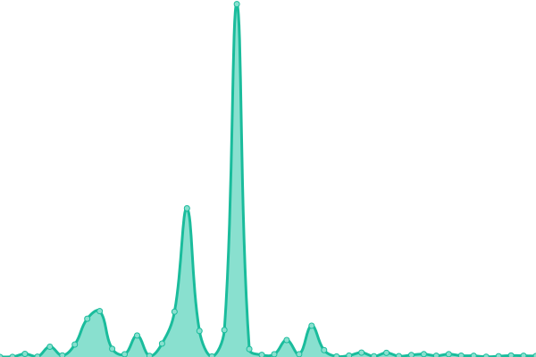
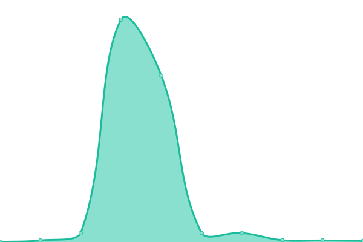

# [📈 Live Status](https://status.dev.basekey.ai): <!--live status--> **🟧 Partial outage**

This repository contains the open-source uptime monitor and status page for [rcm-agent](https://status.dev.basekey.ai), powered by [Upptime](https://github.com/upptime/upptime).

With [Upptime](https://upptime.js.org), you can get your own unlimited and free uptime monitor and status page, powered entirely by a GitHub repository. We use [Issues](https://github.com/rcm-agent/rcm-dev-status/issues) as incident reports, [Actions](https://github.com/rcm-agent/rcm-dev-status/actions) as uptime monitors, and [Pages](https://status.dev.basekey.ai) for the status page.

<!--start: status pages-->
<!-- This summary is generated by Upptime (https://github.com/upptime/upptime) -->
<!-- Do not edit this manually, your changes will be overwritten -->
<!-- prettier-ignore -->
| URL | Status | History | Response Time | Uptime |
| --- | ------ | ------- | ------------- | ------ |
|  [Frontend (dev)](https://dev.basekey.ai/readyz) | 🟥 Down | [frontend-dev.yml](https://github.com/rcm-agent/rcm-dev-status/commits/HEAD/history/frontend-dev.yml) | 

 8471ms
     
 | 

<a href="https://status.dev.basekey.ai/history/frontend-dev">97.14%</a>
    

|  [Orchestrator (dev)](https://dev.basekey.ai/orchestrator/readyz) | 🟩 Up | [orchestrator-dev.yml](https://github.com/rcm-agent/rcm-dev-status/commits/HEAD/history/orchestrator-dev.yml) | 

 89ms
     
 | 

<a href="https://status.dev.basekey.ai/history/orchestrator-dev">98.51%</a>
    

|  [Web Agent (dev)](https://dev.basekey.ai/rcm-web-agent/readyz) | 🟩 Up | [web-agent-dev.yml](https://github.com/rcm-agent/rcm-dev-status/commits/HEAD/history/web-agent-dev.yml) | 

 193ms
     
 | 

<a href="https://status.dev.basekey.ai/history/web-agent-dev">88.94%</a>
    

|  [Memory (dev)](https://dev.basekey.ai/api/memory/readyz) | 🟩 Up | [memory-dev.yml](https://github.com/rcm-agent/rcm-dev-status/commits/HEAD/history/memory-dev.yml) | 

 33ms
     
 | 

<a href="https://status.dev.basekey.ai/history/memory-dev">99.78%</a>
    

<!--end: status pages-->

[**Visit our status website →**](https://status.dev.basekey.ai)

## 📄 License

- Powered by: [Upptime](https://github.com/upptime/upptime)
- Code: [MIT](./LICENSE) © [Anand Chowdhary](https://anandchowdhary.com), supported by [Pabio](https://pabio.com)
- Data in the `./history` directory: [Open Database License](https://opendatacommons.org/licenses/odbl/1-0/)
